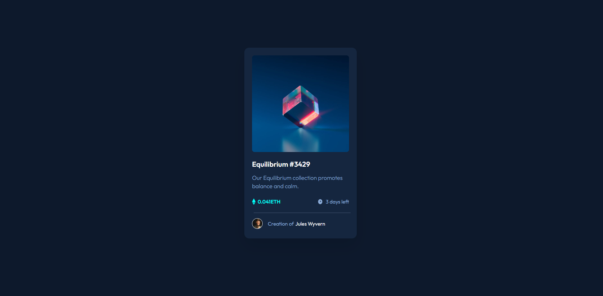

# Frontend Mentor - NFT preview card component solution

This is a solution to the [NFT preview card component challenge on Frontend Mentor](https://www.frontendmentor.io/challenges/nft-preview-card-component-SbdUL_w0U). Frontend Mentor challenges help you improve your coding skills by building realistic projects.

## Table of contents

- [Overview](#overview)
  - [Screenshot](#screenshot)
  - [Links](#links)
- [My process](#my-process)
  - [Built with](#built-with)
  - [What I learned](#what-i-learned)
  - [Useful resources](#useful-resources)
- [Author](#author)

## Overview

### Screenshot

### Links

- Solution URL: [Qr-Code-Component](https://lashasuxa.github.io/NFT-Card-component/)
- Live Site URL: [Qr-Code-Component](https://github.com/lashasuxa/NFT-Card-component)

## My process

### Built with

- Semantic HTML5 markup
- CSS custom properties
- Flexbox
- CSS Grid
- Mobile-first workflow

### What I learned

Basic HTML CSS
Hover

### Useful resources

https://www.w3schools.com/css/css_align.asp

## Author

- Linkedin - [Lasha Sukhashvili](https://www.linkedin.com/in/lasha-sukhashvili-337034150/)
- Github - [lashasuxa](https://github.com/lashasuxa)
